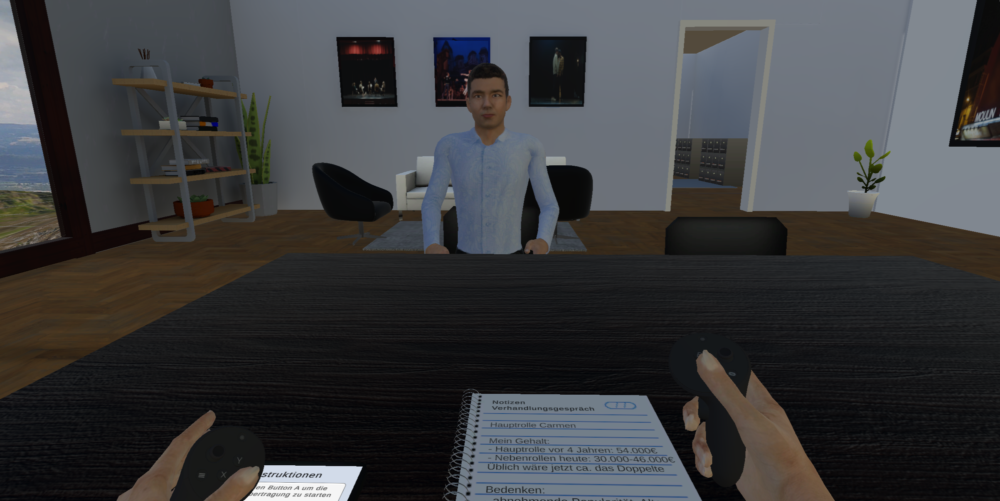
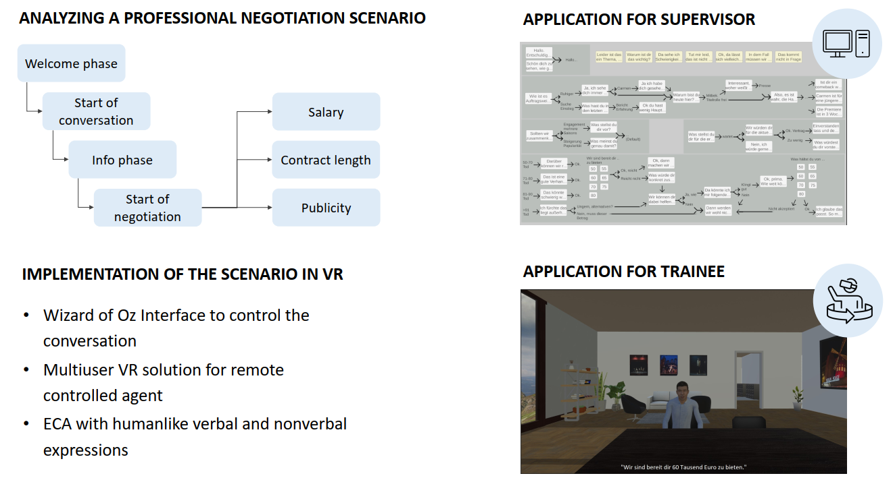
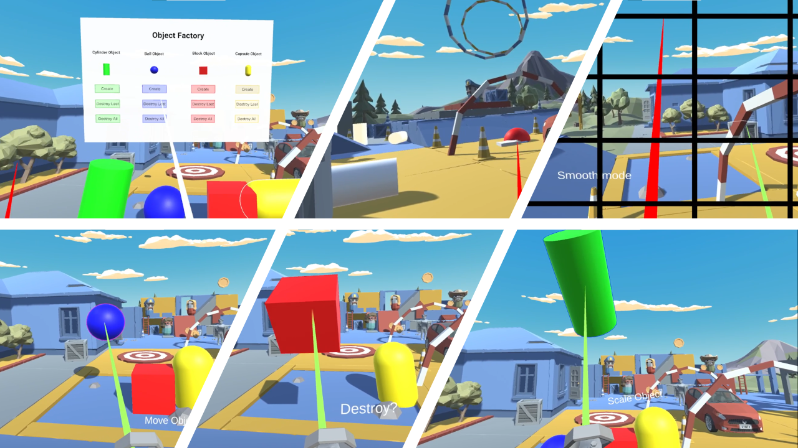

# Tana Glemser
Here are some of the projects I've worked on:

## AR App with Personalized Avatar
- Overview: This AR app scans for a business card and on recognition places a customized virtual avatar on the card, who then waves and introduces herself.

## Automated Negotiation Training in VR

- Overview: This VR application features a GPT-controlled conversation partner for autonomous negotiation training and was developed as part of my master thesis study. The study explores the agency effect through framing of the negotiation agent as human-controlled or AI-controlled.
- Technical Details: The negotiation partner was connected to the GPT-4 model from OpenAI to generate responses, through the OkGoDoIt library. Speech recognition and text-to-speech functionality is implemented with Microsoft Azure. Character models were created with Autodesk Character Generator. Animations are from Mixamo and lip-sync is realized with the SALSA LipSync Suite from CrazyMinnowStudio. Developed in Unity for the Meta Quest Pro.

## Negotiation Training in VR with Remote-Controlled Virtual Agent

- Overview: This virtual reality application allows negotiation training with a wizard-of-oz controlled agent as negotiation partner. The application can be used as supervisor (to control agent through 2D desktop interface) and trainee (to train with agent as partner in VR or on PC), with each being at different locations.
- Technical Details: Utilized Photon PUN 2 for multiuser functionality (no longer supported) and Amazon Polly for speech file generation. Developed in Unity for Meta Quest 2 as standalone application (apk) and as 2D desktop application.

## Augmented Reality App: ifc-viewer
- Overview: This AR app allows for placement, rotation and scaling of a 3D elevator (from an .ifc model).
- Technical Details: developed in Unity for an Android Tablet.

## Machine Learning Framework
- Overview: Machine learning framework package from scratch, to train and predict with a neural network. Suitable for multiclass classification tasks as well as regression problems and binary classification tasks. Includes different activation functions, optimizers as well as feature scaling with a standard scaler. Allows to save trained models and parameters for later initialization from trained parameters.
- Technologies: Python, Jupyter Notebooks

## 3D and Multimodal Interfaces Project in VR

- Overview: University projects in Unity for VR environments with interactive elements. Design and implementation of different navigation techniques, as well as interaction with elements. Design and inegration of 3D interfaces and speech controlled interactions. 

